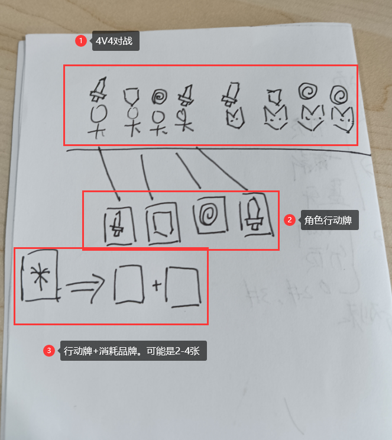

[toc]

# 前言
我本身是一个2022年毕业的计算机本科生，老家浙江的，去杭州干了两年的上位机，感觉工资也没有什么上升的盼头了，打算就回老家了。老家其实是开工厂的，我开工厂去了，后面可能就和计算机没啥关系了。打算现在学一下做游戏，后面写写游戏作为兴趣爱好。

# C# IOC使用
因为我写了两年的.NET ，IOC用的比较多。打算用C# IOC 来写一个完整的游戏项目。我断断续续写了两个月的项目，感觉还行，能用，没试过移动端，后面试试看行不行。优先开发Windows端的游戏，因为移动端上架很麻烦。

# 为什么要开源
反正我估计我第一个游戏也没人看，打算就开源了，估计也赚不了多少钱。

# 游戏的设计
## 美术素材
目前的美术素材打算就直接目前可用的部分，后面再自己画。

## 游戏介绍

### 是什么
仿照暗黑地牢+酒馆战旗的半自动挂机4v4 PVE回合制战斗。

### 有什么特点
注意是和暗黑地牢做对比

- 去掉了闪避和暴击这个随机性。因为每回合获得的行动牌本身就有随机性。
- 作战速度快，因为是大回合行动，不像暗黑地牢一样是每个人都要单独操控
- 具有模糊性，我后面可能将角色的行动牌去掉，大回合前的行动牌

### 为什么做这个

- 回合制相对来说，对引擎的使用要求简单，不需要对物理学理解比较深刻。而且回合制更多的是拼创意，而且移动端移植比较的简单。
- 自己本身就比较的佛学，不太喜欢对操作要求比较高的游戏。比如死亡细胞。

## 游戏背景介绍

- 你遇到个没落的贵族，他因为权力的斗争而被放逐。他的领地被魔物包围，魔物会在血圆之夜主动袭击你的领地。原本的贵族已经逃离，你要去拯救你的家乡。

## 游戏核心玩法

### 模拟经营部分

- 

# 开发日志

## 2024年4月15日
- 新建项目
